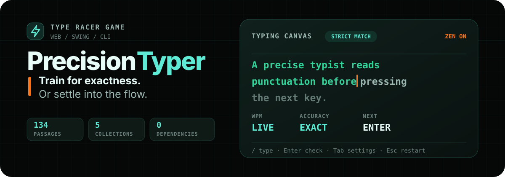
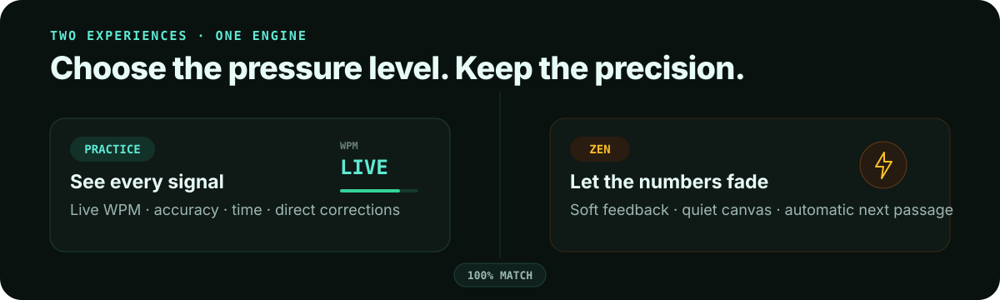

<p align="center">
  
</p>

<p align="center">
  <strong>Exact-match typing practice across four curated collections, from short calm sentences to structured multiline code.</strong><br>
  Keep the performance signals visible, switch on Zen for a quieter session, and move through every pool as a two-way shuffled loop.
</p>

<p align="center">
  <a href="https://precisiontyper.com/"><strong>Play in your browser</strong></a>
  ·
  <a href="https://precisiontyper.com/game.html">Open the typing canvas</a>
  ·
  <a href="#training-library">Explore the training library</a>
</p>

## One rule, two experiences

PrecisionTyper completes a passage only when every character matches. Practice mode keeps WPM, accuracy, and elapsed time visible; Zen mode keeps the same strict engine while hiding evaluative chrome throughout the session, softening feedback, and advancing automatically after a perfect match.

<p align="center">
  
</p>

- **One readable canvas:** correct, current, remaining, and extra characters share the same surface.
- **Visible whitespace:** the next required space appears as `·`, a target line break as `↵`, and a display-only code wrap as `↳`.
- **Keyboard-first control:** `/` focuses the canvas; `Tab`, then `Enter`, opens session settings; an explicit focus path keeps those controls reachable across Chrome, Edge, and Safari; `Cmd/Ctrl + ← / →` moves backward or forward without hitting an endpoint.
- **Optional atmosphere:** Focus removes surrounding chrome, while locally generated key sounds distinguish normal keys, Space, deletion, and Enter.

## Training library

The Web Edition ships **237 passages across twelve independent built-in pools**. Every collection supports Easy, Medium, and Hard.

| Collection | Easy | Medium | Hard | Total |
| --- | ---: | ---: | ---: | ---: |
| **General** | 40 | 36 | 22 | 98 |
| **Calm** | 15 | 15 | 15 | 45 |
| **Quotes** | 15 | 15 | 15 | 45 |
| **Code** | 15 | 19 | 15 | 49 |
| **All built-in passages** | **85** | **85** | **67** | **237** |

[`PrecisionTyper/texts.json`](./PrecisionTyper/texts.json) is the sole passage source. PrecisionTyper validates schema v3 and every collection/difficulty pool before starting; it never silently substitutes a reduced library.

### One difficulty standard

Every passage receives a deterministic **0–100 difficulty score**. Prose combines length, average word length, long-word ratio, precision-mark density, and sentence structure. Code combines length, line count, symbol density, delimiter nesting, indentation, and syntax transitions. Fixed collection-specific thresholds calibrate those shared signals without forcing Calm, Quotes, and Code into the same writing style.

| Tier | Score band | Training load |
| --- | ---: | --- |
| **Easy** | 0–24 | One compact idea or statement, familiar language or syntax, limited punctuation, and little structural switching |
| **Medium** | 40–60 | Multiple clauses or a short multiline structure, moderate punctuation or symbols, and sustained attention across transitions |
| **Hard** | 72–100 | A sustained passage or nested structure with dense punctuation, symbols, line changes, or advanced language and syntax |

A short nested code sample can demand more precision than prose with the same character count. The current score ranges leave visible space between adjacent tiers:

| Collection | Easy scores | Medium scores | Hard scores |
| --- | ---: | ---: | ---: |
| General | 3–20 | 45–56 | 75–91 |
| Calm | 3–14 | 46–53 | 80–87 |
| Quotes | 6–19 | 45–58 | 77–89 |
| Code | 0–18 | 42–57 | 81–96 |

Repository validation rejects a passage assigned outside its score band, reserves a two-point buffer inside each band, and requires adjacent median scores to differ by at least 25 points. The raw feature-load gaps must be at least 10 points for Calm, Quotes, and Code; collection-specific profiles also constrain prose length and structure plus Code line count, nesting, and indentation. Validation continues to enforce an English-keyboard equivalent for every non-ASCII practice character, at least 15 unique passages per pool, verified public-domain sources for every Quote, single-line Easy code, two-to-five-line Medium code, and six-or-more-line Hard code.

## Start typing

### Use the hosted app

**Website**: `https://precisiontyper.com/`

Open **[PrecisionTyper](https://precisiontyper.com/)**, choose **Play now**, and press `/` to focus the typing canvas. Nothing needs to be installed.

For a quiet first session, try **Calm + Easy + Zen + Focus + Sound**. For deliberate practice, combine any built-in collection with a difficulty and turn Zen off to watch live statistics.

### Run it locally

```bash
git clone https://github.com/zhoulinhua0-star/TypeRacerGame.git
cd TypeRacerGame
python3 -m http.server 8000
```

Then open [http://localhost:8000/PrecisionTyper/](http://localhost:8000/PrecisionTyper/).

The landing page can be opened directly, but the game must be served over HTTP so the browser can load `texts.json`. If the passage library cannot load, PrecisionTyper keeps typing disabled and shows the exact local-server or deployment recovery step instead of silently substituting a partial library.

## Keyboard-first workflow

| Action | Shortcut |
| --- | --- |
| Focus the typing canvas | `/` |
| Check, or insert a required target line break | `Enter` |
| Always check for an exact match | `Cmd/Ctrl + Enter` |
| Open session settings | `Tab`, then `Enter` |
| Move through session settings | `Tab` / `Shift + Tab` |
| Change a selected option | `↑` / `↓` |
| Toggle Sound or Zen | `Space` |
| Return from settings to the canvas | `Tab` past either edge, `Esc`, or `/` |
| Restart the current passage | `Esc` |
| Previous passage | `Cmd/Ctrl + ←` |
| Next passage | `Cmd/Ctrl + →` |
| Toggle Focus view | `Cmd/Ctrl + Shift + F` |
| Leave Focus view | `Esc` |

Typing keeps native editing behavior: plain arrow keys, selection, paste, Home, and End continue to work. Every Quote exercise displays typographic quotation marks; passages without dialogue punctuation receive a single outer `“ ”` pair. Passages accept standard English-keyboard equivalents: type `"` for `“` or `”`, `'` for `‘` or `’`, and `-` for `—` or `–`. The same settings workflow works in Zen: `Tab` deterministically focuses the Session settings button, then `Enter` opens the controls. Once open, PrecisionTyper explicitly routes focus through Collection, Difficulty, Sound, and Zen instead of relying on each browser's native Tab preference. That keeps the sequence consistent in Chrome, Edge, and Safari without requiring Safari's “Press Tab to highlight each item on a web page” setting. Tab past either end, or press `Esc` or `/`, to return to the canvas. `Cmd/Ctrl + ← / →` remains available even when a collection or difficulty control has focus. In Code passages, `Enter` inserts a line break only when the target shows `↵`; otherwise it checks the passage. A teal `↳` can mark a visually wrapped code token and is never typed. When the next required character is a space, a temporary `·` makes that invisible character clear.

Each collection/difficulty pair owns one persistent shuffled circular deck. Moving right from the final passage wraps to the first; moving left from the first wraps to the final passage. Completing a passage advances through that same order, so keyboard navigation, the Skip action, and post-completion continuation stay consistent.

With **Sound** enabled, normal characters, Space, Backspace/Delete, and Enter use subtly different low-frequency tap profiles. Sound remains optional and is generated locally in the browser.

### What happens in a session

1. **Choose a collection and difficulty.** General, Calm, Quotes, and Code each include independent Easy, Medium, and Hard pools.
2. **Type exactly.** Correct, current, remaining, extra, and currently required whitespace receive distinct visual feedback in one canvas.
3. **Check with Enter.** A perfect match opens the result overlay; an incomplete match prompts you to correct the passage.
4. **Continue your way.** Press `Enter` after success to advance through the circular deck, or let Zen continue automatically after a short pause.

The timer uses the browser's monotonic clock, and WPM follows the standard five-characters-per-word calculation.

## Three editions

| Edition | Best for | Run it |
| --- | --- | --- |
| **Web · PrecisionTyper** | Single-canvas practice, Zen/Focus sessions, and responsive use | [Open online](https://precisiontyper.com/) or serve `PrecisionTyper/` |
| **Desktop · PrecisionTyper.java** | Strict Java Swing practice with difficulty levels, themes, and synthesized key sounds | `javac PrecisionTyper.java && java PrecisionTyper` |
| **Console · TypeRacerGame.java** | A minimal terminal loop with per-round timing, accuracy, and WPM | `javac TypeRacerGame.java && java TypeRacerGame` |

The Java editions target Java 21+ and run on Windows, macOS, and Linux. The Web Edition uses HTML, CSS, and vanilla JavaScript with no runtime dependencies.

## Quality, privacy, and resilience

- Every bundled passage has a stable ID and source record.
- All 45 Quote entries include verified public-domain literature metadata and Project Gutenberg links.
- The Code collection includes 49 exercises, including 34 multiline passages; project-authored additions are verified under the repository license.
- The remaining 121 project-curated passages are marked as awaiting full provenance review instead of receiving guessed attribution.
- Preferences and circular-deck positions stay in the browser; the app does not upload them.
- Denied or full `localStorage` falls back to in-memory session state without blocking play.
- Each collection-and-difficulty pool uses a persistent shuffled circular order: forward wraps from last to first, and backward wraps from first to last.

## Development

There is no package install step. Before deploying changes, run the repository checks directly with Node:

```bash
node scripts/validate-texts.mjs
node scripts/test-difficulty-score.mjs
node scripts/test-web-logic.mjs
node scripts/test-keyboard-guide.mjs
node scripts/test-site-metadata.mjs
```

These checks cover schema v3, scoring model v3, perceptual profiles, score bands and raw separation, English-keyboard punctuation equivalents, minimum pool sizes, global duplication, public-domain Quote sources, Code structure, explicit database-load errors, independent circular decks, contextual whitespace markers, word-safe wrapping, semantic Enter handling, browser-independent forward and backward settings focus, browser-storage failures, session-wide Zen visibility, Zen session-setting focus restoration, the landing-page keyboard guide focus loop, canonical production metadata, and local static-link integrity.

<details>
<summary><strong>Project structure</strong></summary>

```text
TypeRacerGame/
├── TypeRacerGame.java          # Console edition
├── PrecisionTyper.java         # Java Swing edition
├── PrecisionTyper/
│   ├── index.html              # Web landing page
│   ├── game.html               # Typing canvas
│   ├── website.css             # Landing-page design
│   ├── website.js              # Navigation and keyboard guide
│   ├── styles.css              # Dark game, Zen, and Focus views
│   ├── script.js               # Typing engine and circular-deck persistence
│   ├── robots.txt              # Search crawler policy
│   ├── sitemap.xml             # Canonical production URLs
│   └── texts.json              # Sole versioned passage database
├── assets/readme/              # README visual system
├── scripts/                    # Validation and behavior checks
├── .github/workflows/          # GitHub Pages deployment
├── README.md
└── LICENSE
```

</details>

<details>
<summary><strong>GitHub Pages deployment</strong></summary>

The deployment workflow publishes `PrecisionTyper/` to the custom-domain root. In **Settings → Pages**, set **Build and deployment → Source** to **GitHub Actions**, set **Custom domain** to `precisiontyper.com`, and enable **Enforce HTTPS** after the DNS check succeeds. A push to `main` then deploys the landing page at [precisiontyper.com](https://precisiontyper.com/) and the game at [precisiontyper.com/game.html](https://precisiontyper.com/game.html).

Cloudflare DNS should keep the four GitHub Pages apex `A` records and the `www` CNAME to `zhoulinhua0-star.github.io` in **DNS only** mode. Keep the GitHub domain-verification TXT record. If GitHub reports a failed DNS check, verify those records and wait for propagation; if certificate issuance is still pending after DNS succeeds, leave the records unchanged while GitHub provisions HTTPS. Avoid Cloudflare redirect rules for these hostnames so `www` and HTTP can use GitHub Pages' canonical HTTPS redirect without a loop.

If a deployment looks stale, wait for the **Deploy GitHub Pages** workflow to finish, then hard-refresh with `Cmd+Shift+R` on macOS or `Ctrl+Shift+R` on Windows.

</details>

## License

Released under the [MIT License](./LICENSE).
